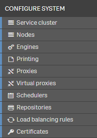
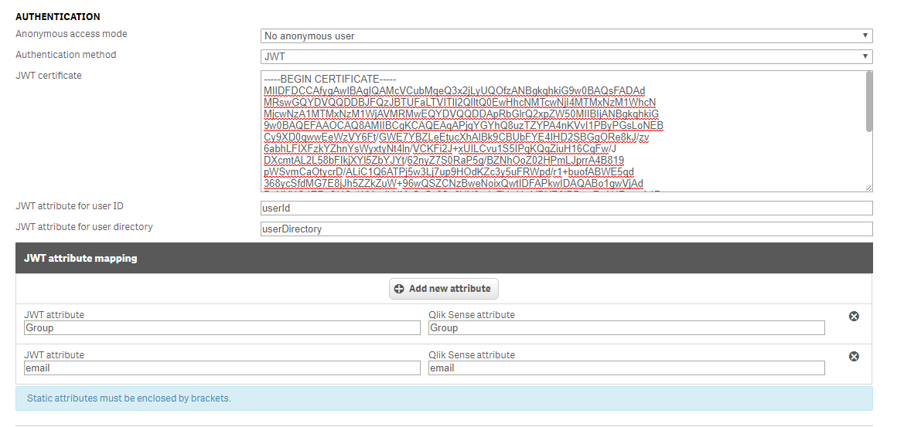
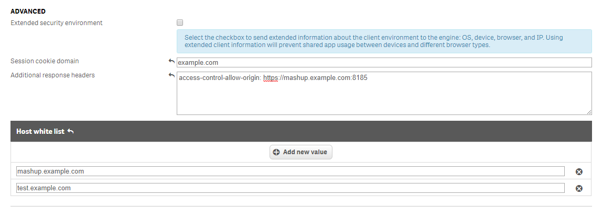
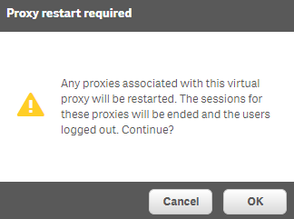
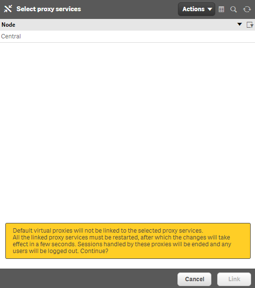

# Configure json web token virtual proxy

>   
1. From the QMC, click on the Virtual proxies menu item in the Configure System section.

2. Click the Create new button on the bottom of the screen.

>   
>   *Refer with steps 3-5*

3. In the Identification section, enter a description and a prefix for the new virtual proxy.  For this example, enter **jwt** for the description and the prefix.

4. For the session cookie header name, update the name of the cookie with **-jwt** appended to the end so it appears as ***X-Qlik-Session-jwt***. 

5. Click on the Authentication menu item on the right side of the screen.

>   
>   *Refer with steps 6-9*

6. For the authentication method of the virtual proxy, select *jwt* from the drop down menu.

7. The JWT certificate is the public certificate that will decrypt the jwt token encrypted with the private key for the certificate.  In this example, the QlikClient certificate is used.  The private key for the QlikClient certificate is used to encrypt the jwt token and the public QlikClient certificate is input into this textarea.  

> ***NOTE** It is possible to use different certificates to encrypt and decrypt the json web token.  The important point is the private key is used to encrypt the token, the public certificate is used to decrypt the token.*

8. Enter the attribute names used to identify the userId and userDirectory from the jwt token into the userId and userDirectory fields respectively.

A sample jwt token may look like this:
```
{
    "userId": "boz",
    "userDirectory": "example",
    "email": "boz@example.com",
    "Group": ["sales", "finance", "marketing"]
}, jwtEncryptionKey, {
    "algorithm": "RS256"
}
```

9. If additional attributes are sent in the token, add them to the additional attributes section.  On the left side is the name of the attribute in the token, and on the right side is the name of the attribute Qlik Sense will use.  In most cases it's easiest to leave them the same.

>   
>   *Refer with steps 10-11*

10. Click on the Advanced menu option on the right side of the screen.

11. In the Advanced section, options may be filled out to support a given scenario.
    
    A. **For the mashup scenario**: Set the session cookie domain to the domain used for the mashup server and Qlik Sense server. By default , the Qlik Sense server will set the cookie domain to the fully qualified name of the white listed hostname the browser is accessing Qlik Sense.
    
    B. **For the mashup scenario**: Set the access-control-allow-origin header to the uri of the mashup including the port.  This is required because the font Qlik Sense uses will not load due to cross-origin scripting prevention.  It is possible to set the header to * but this will allow all websites to access Qlik Sense resources cross site and may present a security risk.
    
    C. **For all scenarios**: Add entries to the host white list for the hostname used for Qlik Sense Server connections and the hostname of the server the mashup is hosted on.  The latter is required for mashups to allow the websocket connection from the server the mashup is hosted on.
    
12. Click the Apply button.  The proxy reset message will appear.  Click Ok.

         

13. On the right side of the screen, the Proxies menu option will appear.  Click on the Proxies menu option.

    

14. Click the Link button at the bottom of the page. The dialog box appears.  Select the proxy to link to the virtual proxy configuration and click the Link button.

    
    
    

15. The QMC will prompt for a refresh.